# 今日头条视频播放流 + 搜索模块 MVP 技术文档

> 声明：本文档中的分析、设计拆解、UML、流程图和排期均为 AI 辅助生成。

## Part 1：实现方式

### 1.1 总体实现思路

项目采用 Flutter + Riverpod 的分层实现方式，核心路径是：

```text
Page / Widget
  ↓
Coordinator
  ↓
ViewModel / Controller
  ↓
Service / Repository
  ↓
DataSource
```

页面层负责展示和交互；Coordinator 负责跨模块流程编排；ViewModel / Controller 负责状态托管；Repository 屏蔽数据来源；DataSource 对接 Mock、本地缓存、离线索引和向量检索。

### 1.2 核心模块


| 模块             | 实现方式                                                             | 关键职责                                  |
| -------------- | ---------------------------------------------------------------- | ------------------------------------- |
| feed           | `FeedPage` + `FeedViewModel` + `FeedPlaybackCoordinator`         | 内容流展示、分页、当前项管理、播放编排入口                 |
| player         | `PlayerController` + `PlayerState` + 播放器 Widgets                 | active 播放器、preload 播放器、播放意图、进度、清晰度和横屏 |
| search         | `SearchViewModel` + `searchResultsProvider` + `SearchRepository` | 搜索历史、搜索结果异步加载、结果回 Feed 定位             |
| recommendation | `RecommendationService` + `recommendationWordsProvider`          | 按当前内容派生推荐词                            |
| observability  | `PlaybackStartupMetrics` + DebugReport                           | 旁路采集起播、首帧、缓冲、预加载事件                    |
| performance    | `PerformanceService`                                             | 消费观测结果，统计优化效果                         |
| storage        | `StorageService` + `SearchHistoryService`                        | 搜索历史和轻量配置存储                           |
| data           | models / repositories / datasources / search_index               | 数据模型、仓库、数据源、离线索引和混合检索                 |


### 1.3 播放实现

播放链路由 Feed 和 Player 分工完成：

- `FeedViewModel` 只维护内容列表、分页状态、当前索引和搜索定位状态。
- `FeedPlaybackCoordinator` 根据当前 FeedItem 类型决定播放、停止、预加载和恢复。
- `PlayerController` 管理真实播放器实例，包括 active controller 和单槽位 preload controller。
- `PlayerState` 向 UI 暴露播放、初始化、缓冲、进度、清晰度、横屏渲染等状态。

预加载采用单槽位策略：只保留一个候选视频，候选选择优先考虑滑动方向；命中时将 preload controller promote 为 active controller。

### 1.4 搜索实现

搜索分为搜索历史和搜索结果两条链路：

- 搜索历史由 `SearchViewModel` 通过 `SearchHistoryService` 存取。
- 搜索结果由 `searchResultsProvider(keyword)` 派生，调用 `SearchRepository.searchVideos(keyword)`。
- 默认数据源为 `DenseSearchDataSource`，优先使用离线业务文档、向量召回和关键词融合排序。
- 搜索配置或离线产物不可用时，回退到 Mock 搜索数据源。

搜索结果点击后不直接操作 Feed 页面状态，而是调用 `FeedPlaybackCoordinator.handleSearchResultSelected()`，再由 `FeedViewModel.focusItemById()` 定位目标视频。

### 1.5 可观测与性能统计

Observability 是旁路能力：

- 记录 `feed_item_visible`、初始化、播放请求、实际播放、首帧、缓冲、preload hit / miss / promote 等事件。
- 所有事件绑定 session，内部处理迟到事件、重复事件和失败事件。
- 不参与播放调度，不控制播放器生命周期，不修改用户播放意图。

当前采样结果显示，preload only 相比 baseline 在 `startup_ms p90 / p95` 和 `first_frame_ms p90 / p95` 上明显下降。

## Part 2：UML 结构

### 2.1 模块关系图

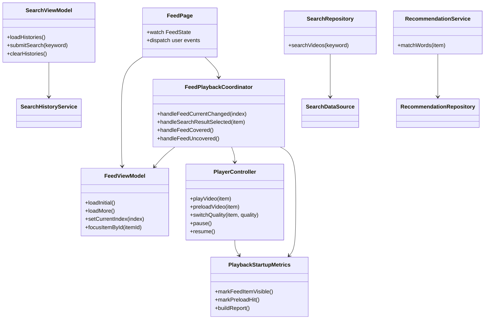


### 2.2 数据模型结构

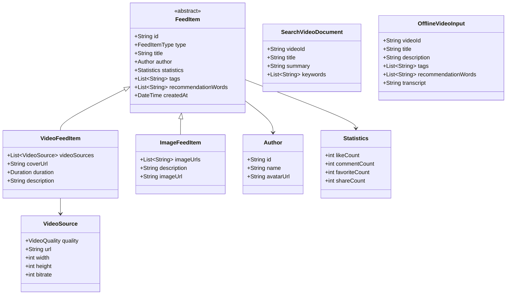


### 2.3 Provider 结构

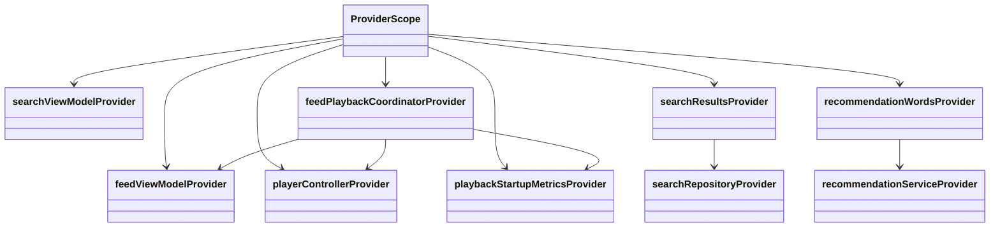


### 2.4 状态对象结构

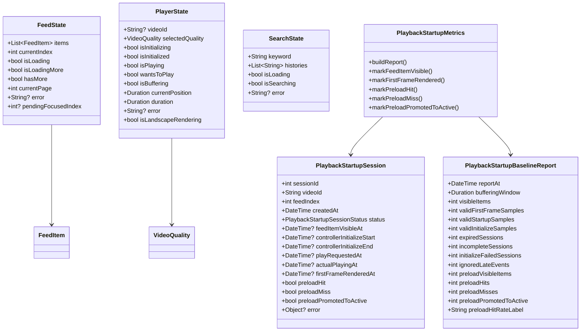


### 2.5 数据访问与搜索索引结构

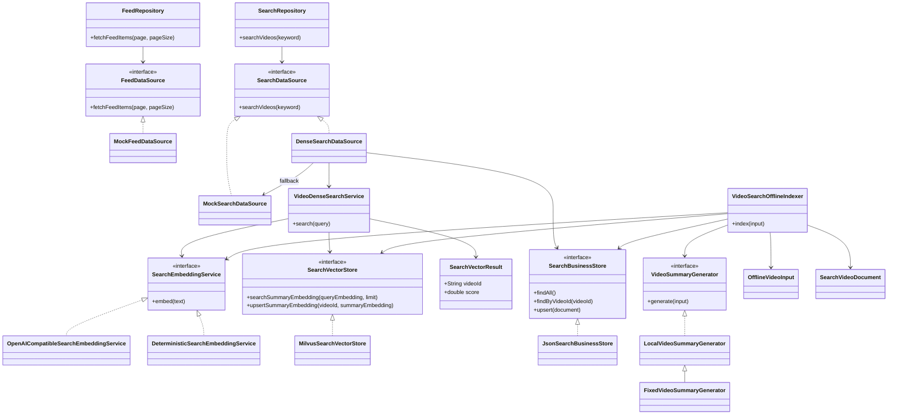


### 2.6 播放器 preload 结构

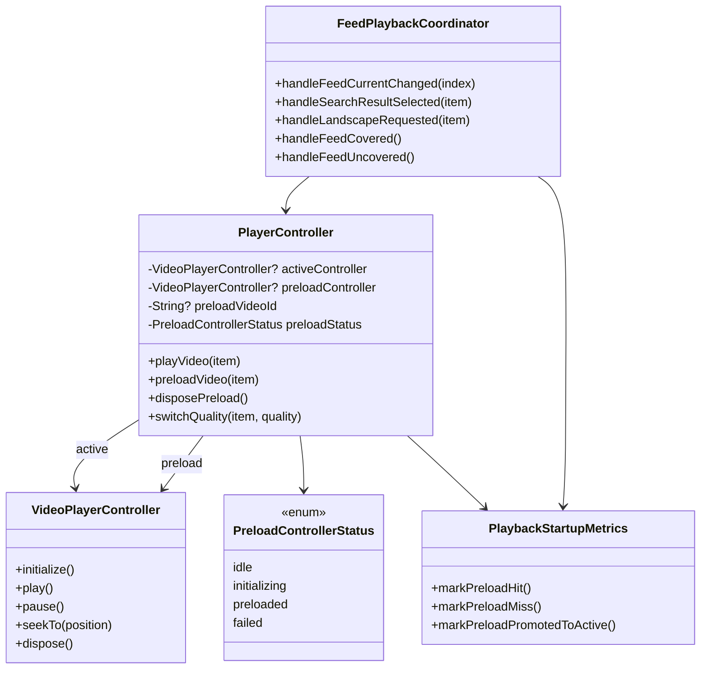


## Part 3：主要流程图

### 3.1 App 启动与首屏播放

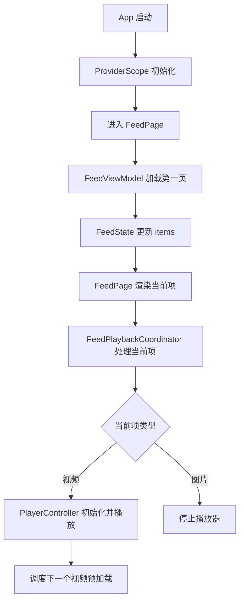


### 3.2 上下滑切换播放

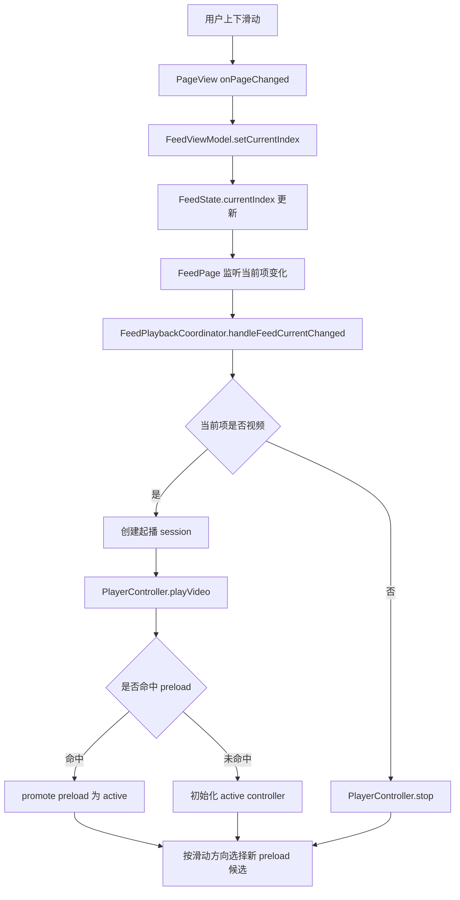


### 3.3 搜索与结果回 Feed

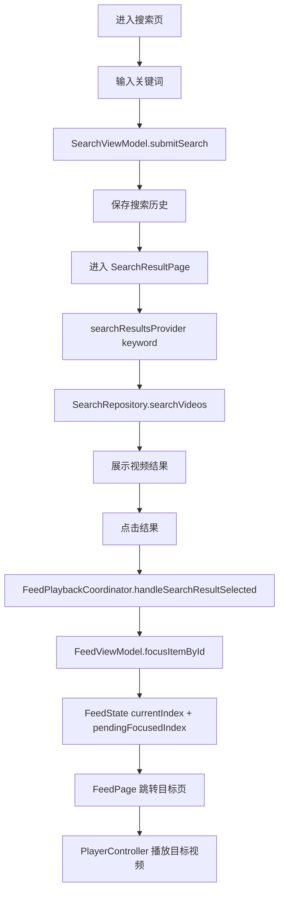


### 3.4 预加载命中热切换

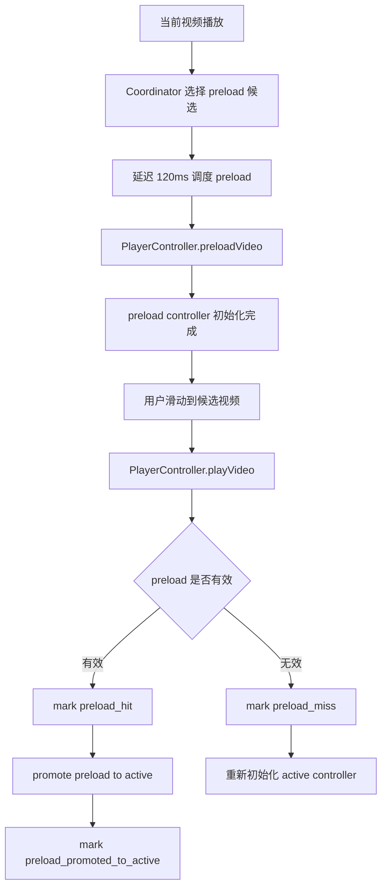


### 3.5 横屏播放

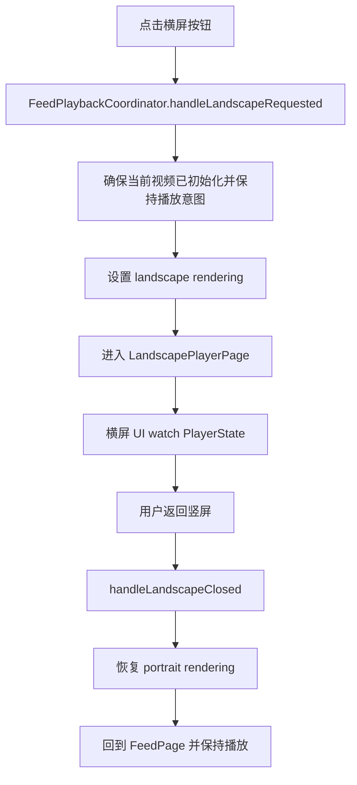


### 3.6 观测与报告

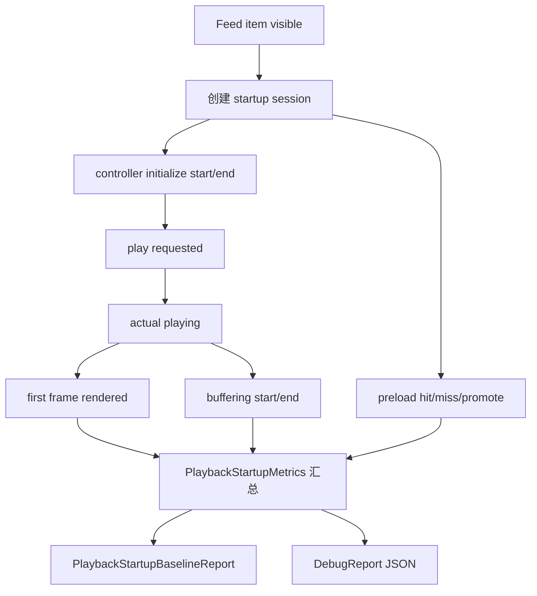


## Part 4：工作拆分 + 排期

### 4.1 工作拆分


| 阶段  | 工作项         | 主要产出                                              |
| --- | ----------- | ------------------------------------------------- |
| W1  | 基础播放链路      | Flutter 工程、Riverpod、Mock 数据、Feed 内容流、基础播放器、搜索入口雏形 |
| W2  | preload 优化  | 单 preload 槽位、方向感知候选、命中 promote、快速滑动收敛、起播观测        |
| W3  | 混合检索 + 交付产物 | 搜索历史、搜索结果、离线索引、Embedding / 向量召回、融合排序、测试和文档        |


### 4.2 排期


| 周期    | 重点          | 验收标准                                                                          |
| ----- | ----------- | ----------------------------------------------------------------------------- |
| 第 1 周 | 基础播放链路      | App 可启动；Feed 可上下滑和分页；视频可播放、暂停、展示进度；图片卡不初始化播放器；搜索入口和推荐词入口可进入对应页面               |
| 第 2 周 | preload 优化  | 单 preload 槽位可初始化和释放；按滑动方向选择候选；命中后 promote 为 active；快速滑动不阻塞当前播放；可导出起播观测 report |
| 第 3 周 | 混合检索 + 交付产物 | 搜索历史和搜索结果链路闭环；离线业务文档、Embedding、向量召回和关键词融合排序可用；关键单元/集成测试通过；技术方案、技术文档和测试记录归档    |


